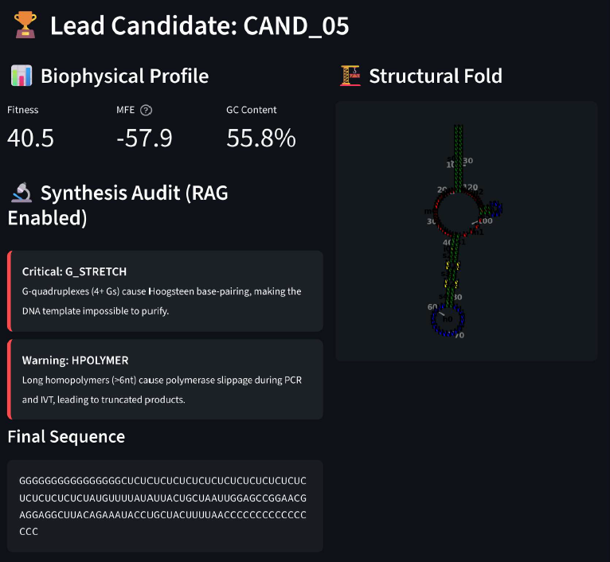

# 🧬 ELITE: Engineered Logic for Industrial-grade Therapeutic Expression  
### Autonomous circRNA Computational Discovery & Manufacturability Pipeline

---

## 🚀 Executive Summary

**ELITE** (Engineered Logic for Industrial-grade Therapeutic Expression) is a vertically integrated, multi-agent computational framework for the **autonomous discovery and validation of therapeutic circular RNA (circRNA)**.

The platform bridges a critical gap in RNA drug design:  
> ensuring that **computationally optimized sequences are not only stable, but also physically manufacturable**.

By combining **codon optimization**, **thermodynamic modeling**, and **industrial synthesis auditing**, ELITE enables an end-to-end pipeline for **high-throughput, build-ready RNA design**.

  

---

## 🎯 Objectives

ELITE is designed to deliver a **production-grade RNA design workflow** with the following goals:

- **Stability Maximization**  
  Engineer circular RNA scaffolds with ultra-stable **Minimum Free Energy (MFE)** profiles.

- **Synthesis Validation**  
  Detect and eliminate motifs that hinder **DNA synthesis, PCR amplification, and IVT**.

- **Scientific Interpretability**  
  Provide **RAG-based explanations** for design decisions and constraint violations.

- **End-to-End Automation**  
  Enable autonomous discovery from peptide input → validated circRNA construct.

---

## ⚠️ Problem Statement

Despite major advances in RNA therapeutics, two key bottlenecks persist:

### 1. Exonuclease Degradation
Linear mRNA molecules contain free **5′ and 3′ ends**, making them highly susceptible to rapid intracellular degradation.

### 2. Manufacturability Gap
High-stability RNA designs often introduce:

- **G-quadruplexes**
- **Homopolymer repeats**
- **GC-rich instability regions**

These lead to:
- Polymerase slippage during PCR  
- Failed DNA synthesis  
- IVT inefficiencies  

---

### ✅ ELITE Solution

ELITE integrates **industrial synthesis constraints directly into the design loop**, ensuring:

> Every **stable design** is also a **buildable design**.

---

## 🧩 System Architecture  
### Kiro AI Agentic Framework

ELITE operates as a **multi-agent system** deployed in a GPU-accelerated environment (T4-class):

### 🔹 1. Sequence Optimization Agent
- Applies **human-weighted codon usage**
- Maximizes **translation efficiency** and protein yield

### 🔹 2. Structural Architect Agent
- Designs **Reverse Complementary Matches (RCM)** for circularization
- Integrates **IRES elements** for cap-independent translation

### 🔹 3. Thermodynamic Audit Agent
- Uses **ViennaRNA** for:
  - Secondary structure prediction  
  - MFE optimization (target: < -50 kcal/mol)

### 🔹 4. Industrial Synthesis Agent (RAG-Enabled)
- Audits sequences against **vendor-grade constraints**
- Flags:
  - G-stretches  
  - Homopolymers  
  - Repeat regions  
- Generates **interpretable scientific justifications**

  

---

## 🔬 Project Scope

ELITE is focused on the **Bio-Design and Pre-Synthesis Audit phases** of the RNA drug discovery lifecycle:

- **Input Target**: Codon-optimized peptide sequences (e.g., 20 AA)
- **Architecture**:
  - circRNA scaffold design  
  - IRES integration  
  - RCM-based circularization  
- **Auditing Metrics**:
  - GC content balance  
  - MFE stability  
  - Synthesis compatibility  

---

## 📊 Benchmark Analysis  
### CAND_05 Lead Candidate
#### Generation run V1
A representative high-performance candidate demonstrates:

| Metric                     | Value              | Interpretation |
|--------------------------|--------------------|----------------|
| **Stability (MFE)**      | -57.9 kcal/mol     | Ultra-stable |
| **GC Content**           | 55.8%              | Optimal for mammalian systems |
| **Fitness Score**        | 40.5               | Balanced stability vs complexity |

**Target Peptide:**  
`FYITANWSRNEEAYRNTCYF`

  

### CAND_05 Lead Candidate
#### Generation run V2
A representative high-performance candidate demonstrates:

| Metric                     | Value              | Interpretation |
|--------------------------|--------------------|----------------|
| **Stability (MFE)**      | -61.1 kcal/mol    | High structural integrity / "Thermodynamic Peace" |
| **GC Content**           | 50.9%             | Perfect industrial balance for manufacturing |
| **Fitness Score**        | 90.3              | Highly optimized for stability and complexity  |

**Target Peptide:**  
`MYFSTTTNDLGWMGYRYAER`

  

---

## 🏭 Competitive Landscape & Alignment

ELITE’s architecture aligns with leading industry platforms:

- **Orna Therapeutics (oRNA®)**  
  → Engineered circular RNA for durable expression  

- **Laronde (Endless RNA - eRNA™)**  
  → Circular scaffolds with IRES-driven translation  

- **DNA Synthesis Providers (IDT, Twist Bioscience)**  
  → Vendor-grade sequence screening replicated via RAG auditing  

---

## ⚙️ Deployment & Reproducibility

ELITE is designed for **cloud-native, reproducible deployment** using an entirely open-source stack:

### 🧠 Core Engine
- ViennaRNA (RNA folding & MFE)
- Biopython

### 📊 Visualization
- Forgi (Bulge graph representation)
- Matplotlib

### 🖥 Interface
- Streamlit (Interactive discovery dashboard)

### ☁️ Compute
- Optimized for **T4 GPU environments** (e.g., Kaggle, GCP, Colab)

---

## 🧪 Key Features

- Multi-agent autonomous RNA design  
- Integrated **thermodynamic + synthesis constraints**  
- RAG-based interpretability layer  
- Industrial-grade audit pipeline  
- Fully open-source and extensible  

---

## 📌 Use Cases

- circRNA therapeutic discovery  
- RNA vaccine design (next-gen platforms)  
- Synthetic biology pipelines  
- Pre-synthesis validation for biotech workflows  

---

## 🔮 Future Work

- **Sequence Self-Healing (Next Iteration)**  
  Development of an automated correction loop that detects problematic **G-stretches** and replaces them with strategically **interrupted motifs**, preserving thermodynamic stability while targeting a **100% synthesis pass rate**.

- Multi-objective optimization (expression vs immunogenicity)  
- Integration with wet-lab feedback loops  
- Real-time synthesis vendor APIs  
- Diffusion-based RNA sequence generation  

---

## 🤝 Contributing

Contributions from researchers and engineers are welcomed in:

- Computational biology  
- RNA therapeutics  
- AI/ML systems  
- Bioinformatics  

---

## 📜 License

This project is released under an open-source license MIT.

---

## 🧠 Acknowledgment

Developed as part of the **Kiro AI initiative**, focused on democratizing **industrial-grade biotechnology through open-source systems**.
